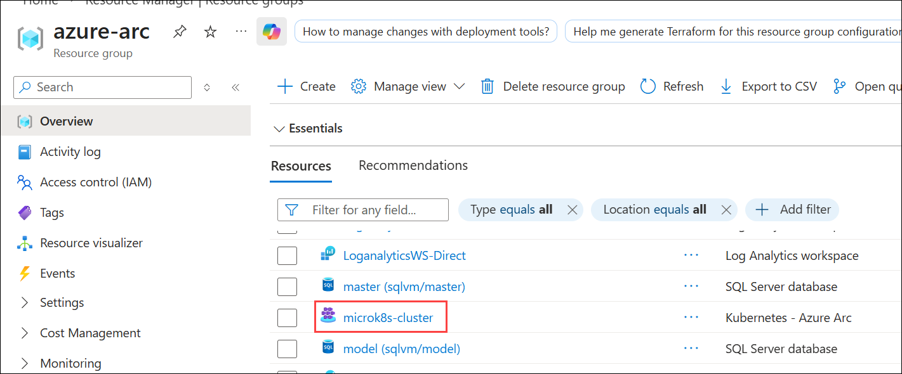
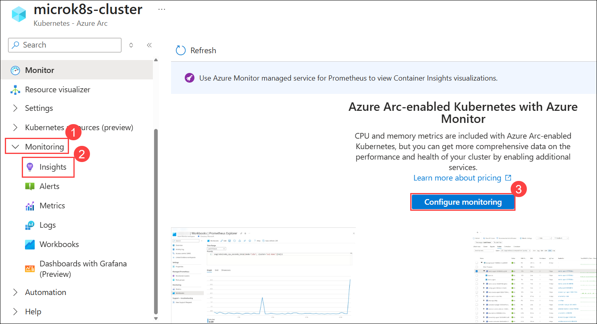
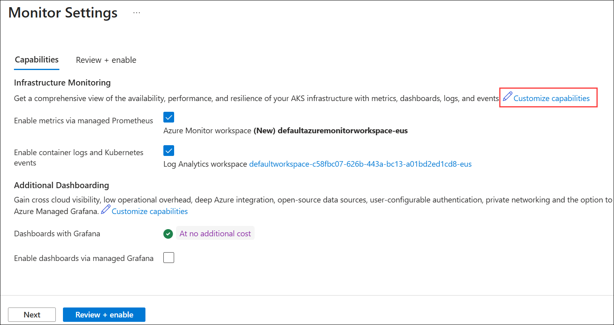
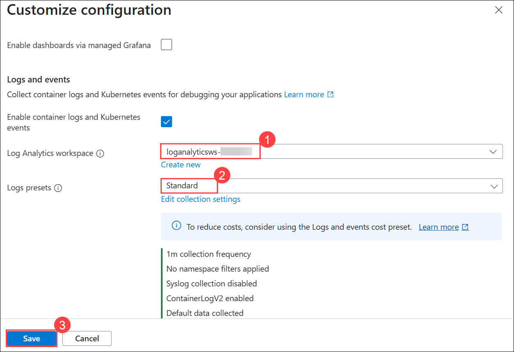
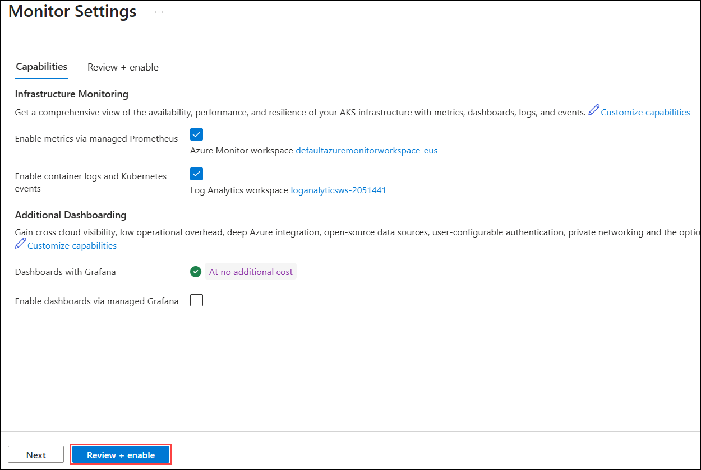
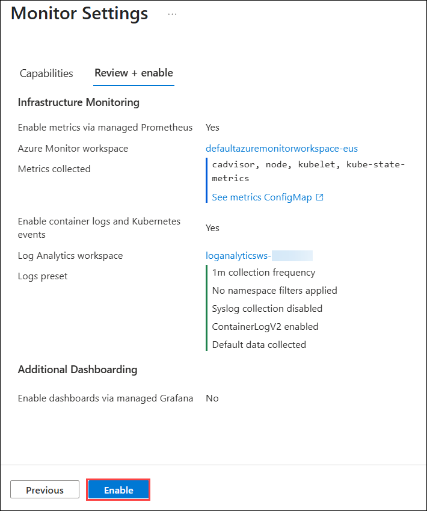

# Exercise 3: Onboard Azure Monitor for containers with Azure Arc-enabled Kubernetes cluster

Contoso's Central IT team is enhancing their monitoring capabilities by configuring Azure Monitor for their Kubernetes clusters. This involves setting up Container insights with a Log Analytics workspace to collect and analyze telemetry data from the Kubernetes cluster. Once configured, they will be able to monitor the cluster's performance and health, enabling proactive management and troubleshooting.

In this exercise, you will see how to configure Azure Monitor for containers and view insights for Kubernetes - Azure Arc resource.

## Objectives

In this exercise, you will be performing the following task:

- Task 1: Configuring Azure Monitor

## Task 1: Configuring Azure Monitor

In this task, you will enable Azure Monitor for your Azure Arc-enabled Kubernetes cluster. You’ll link the cluster to a Log Analytics workspace, configure monitoring, and then explore cluster performance and insights using the Azure Portal. Full telemetry (nodes, pods, containers) becomes visible after some time.

1. Navigate to **azure-arc** resource group and select **microk8s-cluster** Kubernetes - Azure Arc resource from the resources listed.

   

1. On the **microk8s-cluster** pane, expand **Monitoring (1)** from the left navigation pane, select **Insights (2)** and click on **Configure monitoring (3)**.

   

1. Under **Capabilities**, click on **Customize capabilities**.

   

1. For the Log Analytics workspace select the **loganalyticsws-<inject key="DeploymentID" enableCopy="false" />(2)** from the dropdown, from Logs presets dropdown select **Standard (2)** and click on **Save (3)**.

   

1. From the bottom, click on **Review + enable**.

   

1. Then click on **Enable**.

   

1. You will be able to see the insights data after `30-60 minutes`. For now, you can continue with the next **HOL** and come back later to review the insights.

1. In the Insights pane, refresh the page and filter the **Time range = Last 6 Hours (1)**. Click on **Cluster (2)** and review the insights. Now that your cluster is being monitored, you can watch the monitoring telemetry for the cluster, nodes and pods.

   

1. In the same pane, filter the **Time range = Last 6 Hours (1)** and click on **Nodes (2)** and select **ubuntu-k8s**. Here you can observe that the ubuntu-k8s server azure-arc node is listed below, which defines the integration of Azure Arc connected cluster with Azure Monitor for Containers.

   

   

7. In the same pane, filter the **Time range = Last 6 Hours (1)** and click on **Containers (2)**. You will be able to see the list of Containers that are linked to the pod and node which you have monitored in the previous steps.

   

### Conclusion

In this exercise, you configured Azure Monitor for containers on an Azure Arc-enabled Kubernetes cluster. This setup enabled proactive monitoring and troubleshooting by collecting and analyzing telemetry data through Container insights and a Log Analytics workspace.

### Review

In this Exercise, you have completed:
- Configuring Azure Monitor

## You have successfully completed the lab
